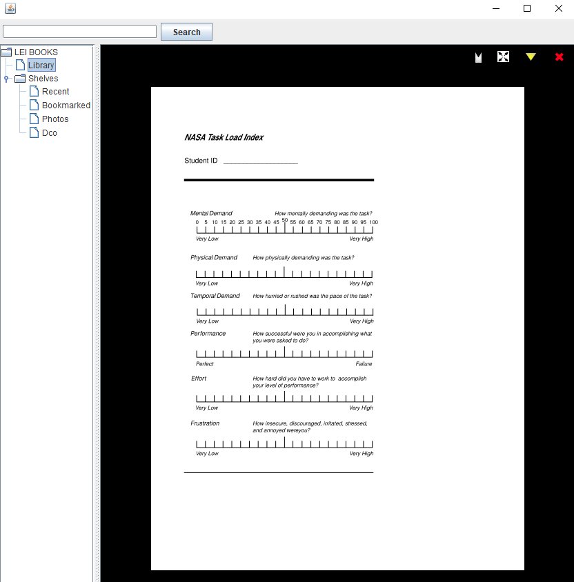
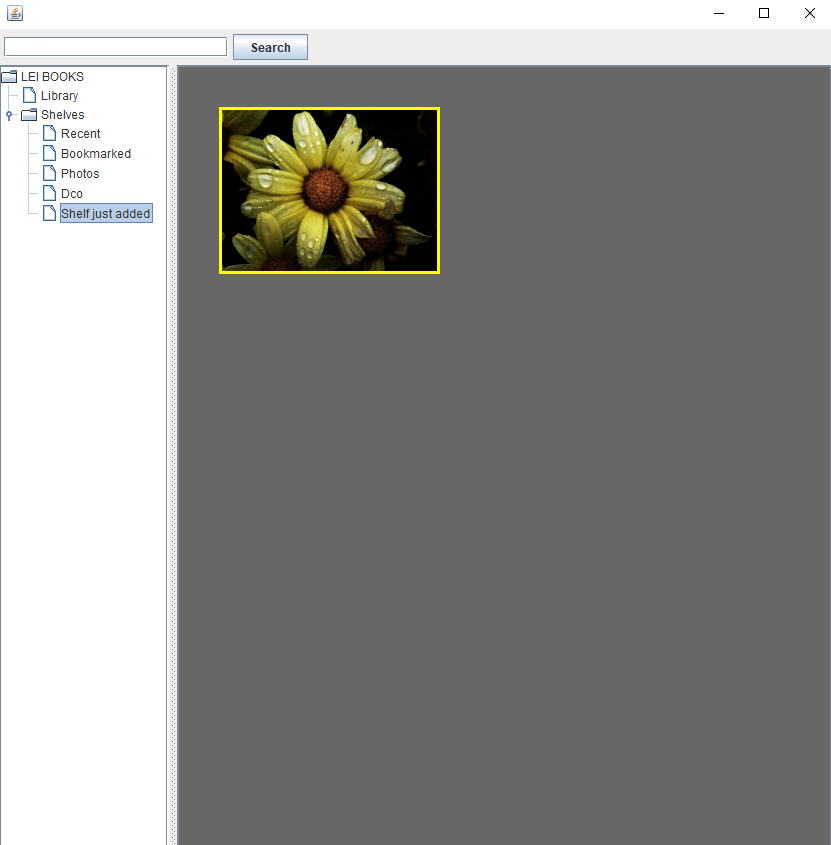
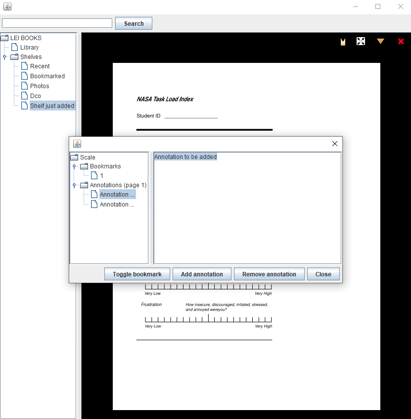

# LeiBooks - Digital Document Organizer

Academic project developed for the curricular unit **Desenvolvimento Centrado em Objetos (Object-Centered Development)** in **Licenciatura em Engenharia Informática** at **Faculdade de Ciências da Universidade de Lisboa (FCUL)**.

## Description

LeiBooks is a digital document organizer that allows users to manage and organize reading resources through a structured system.

## Screenshots

<table align="center">
<tr>

<td align="center">
 
Document Viewer
</td>

<td align="center">
 
Shelf Management
</td>

<td align="center">
 
Annotations & Bookmarks
</td>

</tr>
</table>

## Features

- Create and manage bookshelves
- Add documents (manually loaded into the application) into shelves
- Browse and read documents page by page
- Add annotations to document pages
- Bookmark documents
- Rename documents
- View and delete documents
- Search for documents by author or name

## Project Structure

- `src` - main source code of the application  
- `doc_files` - sample documents used by the application  
- `images` - graphical resources used by the GUI  
- `lib` - external libraries  
- `tests` - project tests  
- `viewers_readers` - document viewers and metadata readers  

## Requirements

- Java **JDK 17** or newer
- Java IDE (recommended: **Eclipse** or **VSCode**)

## Running the Project

Clone or download the repository and import it into a Java IDE.

The client applications are located in:

`LeiBooks > src > leibooks > app`

### GUIClient (Main Application)

The **GUIClient** is the main application and provides the graphical interface that allows users to interact with the system and perform the available operations.

To run the project, execute:

`GUIClient.java`

### SimpleClient (Testing Client)

The **SimpleClient** is a simple testing client that demonstrates the behaviour of the system by executing a predefined sequence of operations and printing the results to the console.

It is mainly intended for **testing and debugging purposes**.

To run it, execute:

`SimpleClient.java`

## Notes

Parts of the application framework, including some interface definitions and base classes, were provided as part of the course assignment.

The original assignment statement is not included in this repository.

## Authors